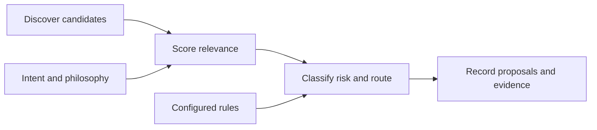

# Intention Engine

[](https://github.com/MaxLaurieHutchinson/Agent-autonomous-intention-engine/actions/workflows/ci.yml)
[](https://github.com/MaxLaurieHutchinson/Agent-autonomous-intention-engine/releases)
[](LICENSE)

**Discover useful work. Keep each decision inspectable.**

A small Python runtime that discovers research candidates, scores them against your priorities, and routes proposals into local queues. Inputs, scores and routing decisions are saved for inspection. OpenClaw scheduling is optional.

**This is a reference implementation, not an autonomous executor.** An approved proposal is a queue entry, not permission to publish, deploy or take another external action.

## Quick start

Use Python 3.11 and Bash for the steps below. The current CI suite runs on Linux.

```bash
git clone https://github.com/MaxLaurieHutchinson/Agent-autonomous-intention-engine.git
cd Agent-autonomous-intention-engine
python3 -m venv .venv
source .venv/bin/activate
python -m pip install -e .
bash ops/bootstrap-workspace.sh
```

Edit `memory/INTENT.md` and `memory/PHILOSOPHY.md` to reflect your priorities. The bundled philosophy is a starting example, not an authorization policy. Review the discovery sources and routing thresholds in [`config/runtime.json`](config/runtime.json), then validate and preview:

```bash
python -m intention_engine_core.cli validate --json
python -m intention_engine_core.cli run --mode micro --dry-run
```

The default sources query Hacker News, Reddit and GitHub. A dry run skips proposal and budget writes, but still contacts configured sources and writes replay files and logs. Bootstrap preserves existing workspace files.

## How it works



Scoring uses keyword overlap, engagement, age, effort and risk heuristics. Routing combines those scores with configured keyword rules:

| Queue | Meaning |
| :--- | :--- |
| `approved` | Meets the configured automatic routing criteria. No action is executed. |
| `inbox` | Requires review under the configured routing rules. |
| `deferred` | Below the relevance or priority threshold. |

Proposals are stored under `memory/proposals/`. Each run records inputs, scores, decisions and a configuration hash under `data/intention-engine-runs/`. Logs, budget state and reflections support local operation.

[Read the architecture](docs/architecture/system-overview.md) and [routing rules](docs/architecture/decision-engine.md).

## Inspect a run

```bash
python -m intention_engine_core.cli status --json
python -m intention_engine_core.cli replay --run-id <run-id>
```

Use the `run_id` returned by a run. Replay verifies routes from captured scores, relevance, autonomy classes and routing configuration. It does **not** refetch sources or recompute scoring.

Keyword checks are triage heuristics, not a security boundary. Any downstream executor needs its own authorization checks. Policy guarded automatic routing and `research_deep` are disabled by default. Explicit BDI state and multiagent challenge loops remain roadmap work.

## Documentation

[Handbook](docs/INDEX.md) · [Runbook](docs/operations/runbook.md) · [Configuration](docs/config/runtime-config-reference.md) · [CLI](docs/reference/cli-reference.md) · [OpenClaw integration](docs/operations/openclaw-integration.md)

## Development

After the editable installation above:

```bash
python -m unittest discover -s tests -v
```

[MIT licensed](LICENSE). See the [changelog](CHANGELOG.md) for release history.
