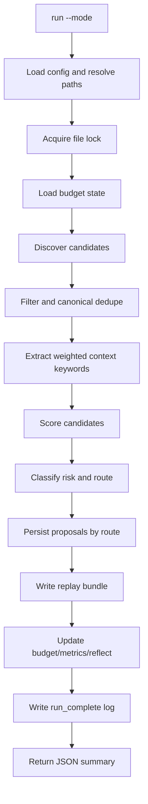

# System Overview

This document describes the implementation that exists today in `src/intention_engine_core/`.

## Design Goals

- deterministic and replayable by default
- file-first state (human-readable + git-friendly)
- safe routing for autonomous operation
- operability first: status, logs, replay bundles, explicit failure surfaces

## Runtime Components

| Component | Implementation | Purpose |
|---|---|---|
| CLI | `src/intention_engine_core/cli.py` + `runtime.py` | command parsing and execution (`run`, `status`, `validate`, `replay`) |
| Path Resolver | `src/intention_engine_core/path_resolver.py` | expands `~`, resolves relative paths against workspace root |
| Discovery | `discover_candidates()` + `sources/registry.py` | fetches candidate opportunities via typed source adapters |
| Scoring | `extract_keywords()` + `score_candidate()` | calculates weighted context relevance plus value/urgency/effort/risk score |
| Risk & Routing | `classify_risk()` + `route_from_values()` | enforces autonomy class and destination queue |
| Persistence | proposal markdown + budget state + metrics + reflection | makes decisions and outcomes durable |
| Replay | `write_replay_bundle()` + `replay_run()` | deterministic post-hoc verification |
| Health | `status_report()` | budget/queues/last run/config errors/announce failures |

## End-to-End Flow

## OODA Mapping (As-Built)

- Observe: `discover_candidates()`
- Observe details: adapter dispatch, per-source filters, canonical URL dedupe
- Orient: `extract_keywords()` + `score_candidate()`
- Decide: `classify_risk()` + `route_from_values()`
- Act: proposal persistence + budget update
- Reflect: `update_metrics()`, `append_reflect_entry()`, replay + logs

## Filesystem Model

Configured through `config/runtime.json` (`paths` block):
- memory: intent, reflect, proposal queues, metrics, briefings
- data: budget state + replay runs
- logs: `engine.jsonl`
- cron jobs state path (OpenClaw jobs JSON)

No hardcoded machine paths are required in runtime behavior.

## Runtime Modes

Defined by `mode_profiles` in config:
- `micro`: enabled, lower cost, smaller candidate selection
- `deep`: enabled, higher cost, larger candidate selection
- `research_deep`: present but disabled by default

## Determinism Contract

Every run writes:
- `inputs.json`
- `scores.json`
- `decisions.json`
- `config-hash.txt`

`inputs.json` and `scores.json` also persist source provenance (`source_stats`, `dedupe_stats`) for auditability.

`replay --run-id` recomputes routing from persisted score/relevance/autonomy data and reports mismatches.

## Operational Boundaries

- Heartbeat behavior is workspace-level in OpenClaw and is not implemented in this repository.
- This repo provides canonical CLI and cron support artifacts used by heartbeat/isolated jobs.
- External posting/actions are not executed by this runtime; outputs are local state artifacts.
- Canonical operational entrypoint is the `intention-engine` executable.
